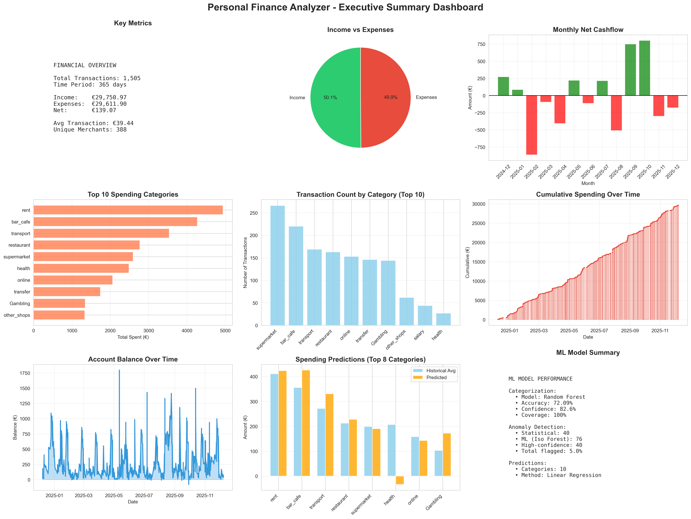

# Personal Finance Analyzer 💰

**ML-powered personal finance analyzer that automatically categorizes transactions, predicts spending, and detects anomalies.**


---

## 📋 Table of Contents
- [Project Overview](#project-overview)
- [Features](#features)
- [Tech Stack](#tech-stack)
- [Project Structure](#project-structure)
- [Installation](#installation)
- [Usage](#usage)
- [Results](#results)
- [Future Improvements](#future-improvements)
- [Author](#author)

---

## 🎯 Project Overview

This project analyzes one year of personal bank transactions (1,638 transactions from Rabobank) to:
1. **Automatically categorize** transactions using Machine Learning
2. **Predict future spending** per category
3. **Detect anomalies** in spending patterns
4. **Visualize insights** through interactive dashboards

**Course**: Data Science & ML Minor  
**Duration**: 7 weeks (Week 10-16)  
**Status**: ✅ Complete

---

## ✨ Features

### 🤖 Machine Learning
- **Random Forest Classifier** for transaction categorization (72% accuracy)
- **Linear Regression** for spending predictions
- **Isolation Forest** for anomaly detection (76 anomalies detected)

### 📊 Data Analysis
- Processed 1,638 transactions over 365 days
- Created 30+ engineered features
- 100% categorization coverage through keyword matching + ML

### 📈 Visualizations
- **11 Python visualizations** (matplotlib, seaborn, plotly)
- **3 Interactive HTML dashboards** (Plotly)
- **Power BI dashboard** with 2 pages (Overview + Predictions)

### 🔍 Key Insights
- Total Income: €2,975
- Total Expenses: €2,961
- Net Cashflow: €13.9K
- 5% of transactions flagged as anomalies
- Predicted next month spending: [Your amount here]

---

## 🛠️ Tech Stack

**Languages & Tools:**
- Python 3.11.7
- Power BI Desktop
- VS Code
- Git & GitHub

**Python Libraries:**
```
pandas         # Data manipulation
numpy          # Numerical computing
scikit-learn   # Machine learning
matplotlib     # Static visualizations
seaborn        # Statistical visualizations
plotly         # Interactive visualizations
jupyter        # Notebooks
```

---

## 📁 Project Structure
```
personal-finance-analyzer/
│
├── data/
│   ├── raw/                      # Original CSV from bank
│   ├── processed/                # Cleaned and featured data
│   ├── models/                   # Saved ML models (.pkl)
│   └── powerbi/                  # Power BI data sources
│
├── notebooks/
│   ├── 01_data_loading.ipynb            # Data import
│   ├── 02_data_cleaning.ipynb           # Data cleaning & EDA
│   ├── 03_feature_engineering.ipynb     # Feature creation
│   ├── 04_categorization_model.ipynb    # ML categorization
│   ├── 05_model_improvement.ipynb       # Model optimization
│   ├── 06_spending_predictions.ipynb    # Spending forecasts
│   ├── 07_anomaly_detection.ipynb       # Anomaly detection
│   ├── 08_final_visualizations.ipynb    # Summary dashboards
│   └── 09_powerbi_prep.ipynb            # Power BI data prep
│
├── visualizations/               # All generated charts (PNG/HTML)
├── powerbi/                      # Power BI dashboard (.pbix)
├── docs/                         # Documentation
│
├── requirements.txt              # Python dependencies
├── README.md                     # This file
└── .gitignore                    # Git ignore rules
```

---

## 🚀 Installation

### Prerequisites
- Python 3.11.7+
- Power BI Desktop (optional, for dashboard)

### Setup

1. **Clone the repository**
```bash
git clone https://github.com/YOUR-USERNAME/personal-finance-analyzer.git
cd personal-finance-analyzer
```

2. **Create virtual environment**
```bash
python -m venv venv
source venv/bin/activate  # On Windows: venv\Scripts\activate
```

3. **Install dependencies**
```bash
pip install -r requirements.txt
```

4. **Run Jupyter notebooks**
```bash
jupyter notebook
```

---

## 💡 Usage

### Running the Analysis

**Step-by-step workflow:**

1. **Data Loading**: `01_data_loading.ipynb`
   - Load CSV from your bank
   - Initial data inspection

2. **Data Cleaning**: `02_data_cleaning.ipynb`
   - Clean and transform data
   - Handle missing values

3. **Feature Engineering**: `03_feature_engineering.ipynb`
   - Create 30+ features
   - Keyword-based categorization

4. **ML Categorization**: `04_categorization_model.ipynb` + `05_model_improvement.ipynb`
   - Train Random Forest classifier
   - Achieve 72% accuracy

5. **Predictions**: `06_spending_predictions.ipynb`
   - Forecast next month spending
   - Per-category predictions

6. **Anomaly Detection**: `07_anomaly_detection.ipynb`
   - Detect unusual transactions
   - Statistical + ML methods

7. **Visualizations**: `08_final_visualizations.ipynb`
   - Generate all charts
   - Create interactive dashboards

8. **Power BI Dashboard**: Open `powerbi/Personal_Finance_Dashboard.pbix`

---

## 📊 Results

### Model Performance
| Model | Accuracy/Metric | Purpose |
|-------|----------------|---------|
| Random Forest | 72.09% | Transaction categorization |
| Linear Regression | MAE: €15.93 | Spending prediction |
| Isolation Forest | 5% anomaly rate | Anomaly detection |

### Key Findings
- **Top spending category**: rent (4.9k euro)
- **Most frequent merchant**: Albert Heijn (142 transactions)
- **Highest anomaly**: €1366 on [13-10-2025]
- **Average transaction**: €39,42

### Visualizations

*Executive summary with 9 key metrics and visualizations*

---

## 🔮 Future Improvements

- [ ] Real-time data pipeline with bank API integration
- [ ] Mobile app for on-the-go insights
- [ ] Budget recommendations based on predictions
- [ ] Category-specific spending limits with alerts
- [ ] Multi-account support
- [ ] Export to Excel with automated reports

---

## 👨‍💻 Author

**[Jasper Croijmans]**
- Project: Data Science & ML Minor
- Year: 2025-2026

---

## 📄 License

This project is for educational purposes only.

---

## 🙏 Acknowledgments

- **Rabobank** for transaction data format
- **Anthropic Claude** for development assistance
- **Course instructors** for project guidance

---